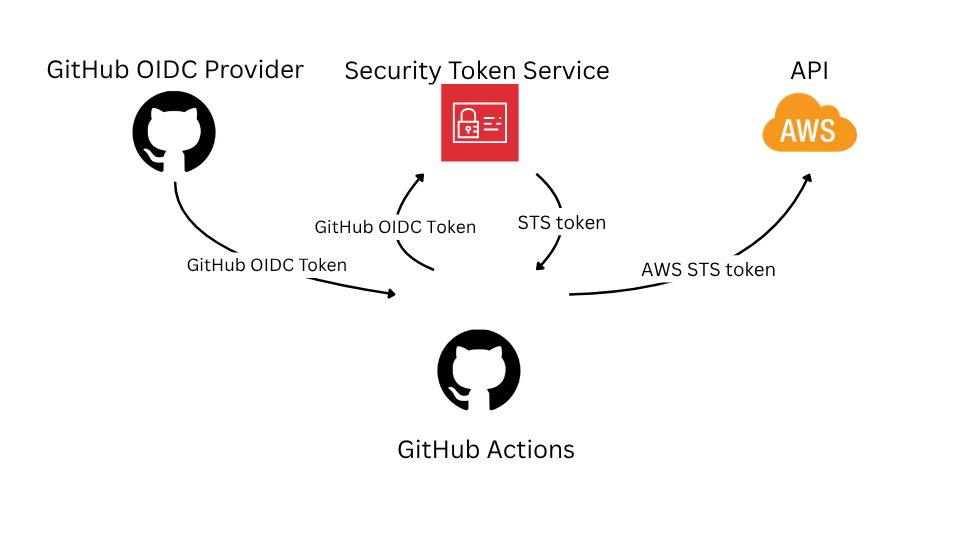

# OIDC: AWS OIDC Federation



## Introduction

In my previous posts, I briefly mentioned the important topic of zero static credentials. This is especially relevant today, as interactions with AI agents in protected environments can unexpectedly expose credentials.

In this part, I explain how to authenticate my GitHub Actions jobs with the AWS API to provision AWS resources without static credentials.

## GitHub OIDC Provider

GitHub provides a [GitHub Actions OIDC provider](https://docs.github.com/en/actions/concepts/security/openid-connect), so our repository, refs, pull requests, and even environments can act as identities for resource servers that accept OIDC tokens.

### Token

Token example from the official documentation:
```json
{
  "typ": "JWT",
  "alg": "RS256",
  "x5t": "example-thumbprint",
  "kid": "example-key-id"
}
{
  "jti": "example-id",
  "sub": "repo:octo-org/octo-repo:environment:prod",
  "environment": "prod",
  "aud": "https://github.com/octo-org",
  "ref": "refs/heads/main",
  "sha": "example-sha",
  "repository": "octo-org/octo-repo",
  "repository_owner": "octo-org",
  "actor_id": "12",
  "repository_visibility": "private",
  "repository_id": "74",
  "repository_owner_id": "65",
  "run_id": "example-run-id",
  "run_number": "10",
  "run_attempt": "2",
  "runner_environment": "github-hosted",
  "actor": "octocat",
  "workflow": "example-workflow",
  "head_ref": "",
  "base_ref": "",
  "event_name": "workflow_dispatch",
  "repo_property_workspace_id": "ws-abc123",
  "ref_type": "branch",
  "job_workflow_ref": "octo-org/octo-automation/.github/workflows/oidc.yml@refs/heads/main",
  "iss": "https://token.actions.githubusercontent.com",
  "nbf": 1632492967,
  "exp": 1632493867,
  "iat": 1632493567
}
```

The most important part is the `sub` claim.
> `sub` is the stable subject identifier for the token issuer, and it is usually the safest way to correlate a returning principal.

The `sub` claim can vary depending on whether the job runs against a ref, tag, pull request, or environment.

#### Environment

The subject claim includes the environment name when the job [references](https://docs.github.com/en/actions/reference/security/oidc#filtering-for-a-specific-environment) an environment.

Syntax:
> repo:ORG-NAME/REPO-NAME:environment:ENVIRONMENT-NAME

Example:
> repo:octo-org/octo-repo:environment:Production

#### Specific branch

The subject claim includes the branch name of the workflow, but only if the job doesn't reference an environment, and if the workflow is not triggered by a pull request event.

Syntax:
> repo:ORG-NAME/REPO-NAME:ref:refs/heads/BRANCH-NAME

Example:
> repo:octo-org/octo-repo:ref:refs/heads/demo-branch

More information is available in the [official documentation](https://docs.github.com/en/actions/reference/security/oidc).

### Token request

There is an [official GitHub Action](https://docs.github.com/en/actions/how-tos/secure-your-work/security-harden-deployments/oidc-in-aws) that helps not only with requesting a token, but also with configuring the AWS CLI to use it in a simple way.

```yaml
name: AWS example workflow
on:
  push
env:
  AWS_REGION : "AWS-REGION"
  ROLE-TO-ASSUME: "ROLE-ARN"
# permission can be added at job level or workflow level
permissions:
  id-token: write   # This is required for requesting the JWT
  contents: read    # This is required for actions/checkout
jobs:
  AWSGetCallerIdentity:
    runs-on: ubuntu-latest
    steps:
      - name: Git clone the repository
        uses: actions/checkout@v6
        with:
          fetch-depth: 0
      - name: configure aws credentials
        uses: aws-actions/configure-aws-credentials@v6.1.0
        with:
          role-to-assume: ${{ env.ROLE-TO-ASSUME }}
          aws-region: ${{ env.AWS_REGION }}
          output-credentials: true
      - name: get caller identity
        run: |
            aws sts get-caller-identity
```
More information is available in the [GitHub Action repository](https://github.com/aws-actions/configure-aws-credentials).

## AWS Federation

[AWS OIDC Federation](https://docs.aws.amazon.com/IAM/latest/UserGuide/id_roles_providers_oidc.html) allows us to use any OIDC IdP (Identity Provider) to obtain AWS STS tokens with role permissions, which we can then use to manage AWS resources.

First, I need to register the GitHub OIDC provider as an IdP in my AWS account. This can be done through the AWS Console or CLI, as described [here](https://docs.aws.amazon.com/IAM/latest/UserGuide/id_roles_providers_create_oidc.html).
```bash
aws iam create-open-id-connect-provider --url \
"https://token.actions.githubusercontent.com" --thumbprint-list \
"6938fd4d98bab03faadb97b34396831e3780aea1" --client-id-list \
'sts.amazonaws.com'
```

Next, I need to create a role with the correct trust policy.
```json
{
    "Version": "2012-10-17",
    "Statement": [
        {
            "Effect": "Allow",
            "Principal": {
                "Federated": "arn:aws:iam::<ACCOUNT_ID>:oidc-provider/token.actions.githubusercontent.com"
            },
            "Action": "sts:AssumeRoleWithWebIdentity",
            "Condition": {
                "StringLike": {
                    "token.actions.githubusercontent.com:sub": "repo:<ORG-NAME/REPO-NAME>:*"
                },
                "StringEquals": {
                    "token.actions.githubusercontent.com:aud": "sts.amazonaws.com"
                }
            }
        }
    ]
}
```
Pay attention to the `sub` claim. It can vary depending on the event type described in the previous section. When using the `aws-actions/configure-aws-credentials` action, the token includes the `"aud": "sts.amazonaws.com"` claim.


## GitHub Actions Job

Let's put all of this together in a working workflow for the demo project.

### Registering GitHub OIDC as an IdP in AWS

[oidc.tf](/IaC/demo-core/oidc.tf)
```terraform
resource "aws_iam_openid_connect_provider" "github" {
  url            = "https://token.actions.githubusercontent.com"
  client_id_list = ["sts.amazonaws.com"]
}
```

### Create a role for GitHub Actions jobs

[role.tf](/IaC/demo-core/role.tf)
```terraform
data "aws_iam_policy_document" "tf_execution_role_policy" {
  statement {
    actions = ["sts:AssumeRoleWithWebIdentity"]
    effect  = "Allow"

    principals {
      type        = "Federated"
      identifiers = [aws_iam_openid_connect_provider.github.arn]
    }

    condition {
      test     = "StringEquals"
      variable = "token.actions.githubusercontent.com:aud"
      values   = ["sts.amazonaws.com"]
    }

    condition {
      test     = "StringLike"
      variable = "token.actions.githubusercontent.com:sub"
      values   = ["repo:${local.config.env.repository.name}:environment:${local.config.env.repository.protected_environment}"]
    }
  }
}

resource "aws_iam_role" "tf_execution_role" {
  name               = local.config.env.tf_role_name
  assume_role_policy = data.aws_iam_policy_document.tf_execution_role_policy.json
}
```
Note that I allow tokens only from a specific environment in the `sub` claim.

### Create a GitHub Actions workflow

[deploy-IaC.yml](/.github/workflows/deploy-IaC.yml)
```yaml
permissions:
  contents: read
  id-token: write

jobs:
  deploy:
    name: IaC Deploy
    environment: 
      name: production
    runs-on: ubuntu-24.04-arm

    steps:
      - uses: actions/checkout@v4
        with:
          fetch-depth: 0
    
      - name: Configure AWS Credentials
        id: creds
        uses: aws-actions/configure-aws-credentials@v6.1.0
        with:
            aws-region: ${{ vars.AWS_REGION }}
            role-to-assume: ${{ secrets.AWS_ROLE_TO_ASSUME_ARN }}
            output-credentials: true

      - name: get caller identity
        run: |
            aws sts get-caller-identity
```

## Additional links

- [Use IAM roles to connect GitHub Actions to actions in AWS](https://aws.amazon.com/blogs/security/use-iam-roles-to-connect-github-actions-to-actions-in-aws/) - AWS Security Blog