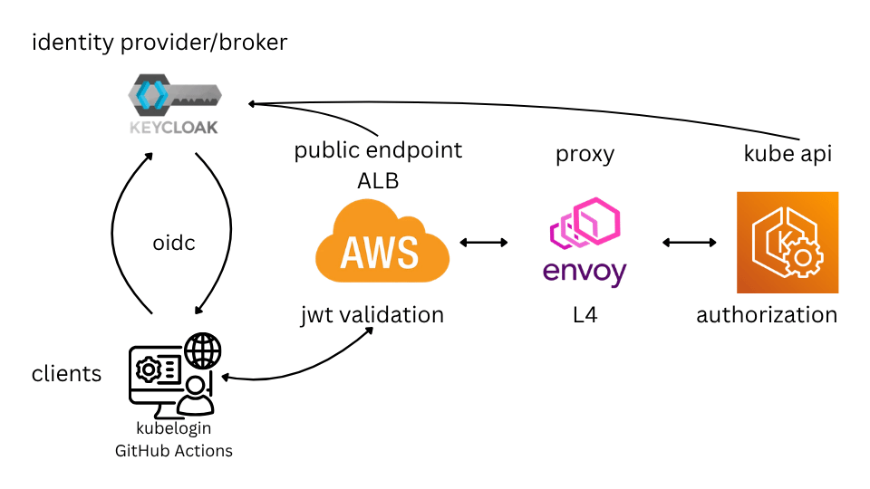

# OIDC: JWT validation with ALB controller and Gateway API



## Introduction

AWS recently [announced](https://aws.amazon.com/blogs/networking-and-content-delivery/aws-load-balancer-controller-adds-general-availability-support-for-kubernetes-gateway-api/) the general availability of Amazon Web Services (AWS) Load Balancer Controller support for Kubernetes Gateway API.

Furthermore, AWS added custom resource definitions (CRDs) to implement [ELB listeners and target rules](https://docs.aws.amazon.com/elasticloadbalancing/latest/application/listener-verify-jwt.html) via a [declarative approach](https://kubernetes-sigs.github.io/aws-load-balancer-controller/latest/guide/gateway/listenerruleconfig/).

Let's put these new possibilities into practice.

Since a public endpoint to access EKS cluster is considered unsafe. I am going to add [OIDC](https://openid.net/developers/how-connect-works/) authorization to my [EKS cluster](https://docs.aws.amazon.com/eks/latest/userguide/authenticate-oidc-identity-provider.html) and add [JWT token validation](https://docs.aws.amazon.com/elasticloadbalancing/latest/application/listener-verify-jwt.html) with ALB controller. So I will put all security responsibilities (validation and authentication) on the AWS side (at no extra cost) and only run [Envoy](https://www.envoyproxy.io/) to proxy kube api at L4.

## ALB installation

[Here](https://kubernetes-sigs.github.io/aws-load-balancer-controller/latest/deploy/installation/) are the full instructions, and [here](https://github.com/AleksandrSor/demo-infra/blob/main/fluxcd/clusters/prod/aws-load-balancer-controller.yaml) is my deployment via FluxCD. 

```yaml
apiVersion: source.toolkit.fluxcd.io/v1
kind: HelmRepository
metadata:
  name: eks
  namespace: kube-system
spec:
  url: https://aws.github.io/eks-charts
---
apiVersion: helm.toolkit.fluxcd.io/v2
kind: HelmRelease
metadata:
  name: aws-load-balancer-controller
  namespace: kube-system
spec:
  chart:
    spec:
      chart: aws-load-balancer-controller
      version: "3.x"
      sourceRef:
        kind: HelmRepository
        name: eks
  interval: 30m
  releaseName: aws-load-balancer-controller
  values:
    replicaCount: 1
    serviceAccount:
      create: true
      name: aws-load-balancer-controller
    clusterName: demo-infra-eks-cluster
    defaultTargetType: ip
    defaultLoadBalancerScheme: internal
    ingressClassConfig:
      default: true
```

ALB controller AWS api access granted via [pod identity](https://docs.aws.amazon.com/eks/latest/userguide/pod-identities.html).
[Here](https://github.com/AleksandrSor/demo-infra/blob/main/IaC/aws-eks/alb-role.tf) is a terraform/tofu example to provision it.

## Gateway class

Default Gateway settings. A full working example can be found [here](https://github.com/AleksandrSor/demo-infra/blob/main/fluxcd/infra/aws-load-balancer-gateway-customization/base/settings.yaml).
```yaml
apiVersion: gateway.k8s.aws/v1
kind: TargetGroupConfiguration
metadata:
  name: tg-config-default
  namespace: kube-system
spec:
  defaultConfiguration:
    targetType: ip
---
# GatewayClass LBC references it
apiVersion: gateway.k8s.aws/v1
kind: LoadBalancerConfiguration
metadata:
  name: lb-internet-default
  namespace: kube-system
spec:
  mergingMode: prefer-gateway 
  scheme: internet-facing
  ipAddressType: dualstack
  defaultTargetGroupConfiguration:
    name: tg-config-default
---
# GatewayClass points to the LBC
apiVersion: gateway.networking.k8s.io/v1
kind: GatewayClass
metadata:
  name: default
spec:
  controllerName: gateway.k8s.aws/alb
  parametersRef:
    group: gateway.k8s.aws
    kind: LoadBalancerConfiguration
    name: lb-internet-default
    namespace: kube-system
```

## Keycloak

I am going to use [Keycloak](https://www.keycloak.org/) as an OIDC identity provider. [Cloid-IAM](https://www.cloud-iam.com/) lets you have a managed Keycloak instance for 1 realm and 100 users for free. It is ideal for testing playground.

Keycloak configuration is beyond the scope of this article for simplicity reasons. I promise to publish how to do it next!

## EKS OIDC provider
Instructions from AWS can be found [here](https://docs.aws.amazon.com/eks/latest/userguide/authenticate-oidc-identity-provider.html).

Terraform/tofu example [here](https://github.com/AleksandrSor/demo-infra/blob/main/IaC/aws-eks-oidc/eks-identity-provider.tf). 

```hcl
resource "aws_eks_identity_provider_config" "eks_oidc_provider" {
  cluster_name = var.eks_cluster_name
  oidc {
    identity_provider_config_name  = "demo-infra-keycloak"
    client_id                      = "demo-infra-kube-api"
    issuer_url                     = https://<keycloak_url>/auth/realms/<keycloak_realm>"

    groups_claim  = "roles"
    groups_prefix = "oidc:"

    username_claim  = "username"
    username_prefix = "oidc-"
  }  
}
```

## Envoy

A full working example can be found [here](https://github.com/AleksandrSor/demo-infra/tree/main/fluxcd/infra/envoy-kube-proxy).

```yaml
apiVersion: apps/v1
kind: Deployment
metadata:
  name: envoy-kube-proxy
  labels:
    app: envoy-kube-proxy
spec:
  replicas: 1
  selector:
    matchLabels:
      app: envoy-kube-proxy
  template:
    metadata:
      labels:
        app: envoy-kube-proxy
    spec:
      containers:
      - name: envoy
        image: envoyproxy/envoy:v1.37-latest
        ports:
        - containerPort: 8443
          name: proxy
        - containerPort: 9901
          name: admin
        volumeMounts:
        - name: config-volume
          mountPath: /etc/envoy
      volumes:
      - name: config-volume
        configMap:
          name: envoy-kube-proxy-config
---
apiVersion: v1
kind: Service
metadata:
  name: envoy-kube-proxy
spec:
  selector:
    app: envoy-kube-proxy
  ports:
  - name: proxy
    port: 8443
    targetPort: 8443
  - name: admin
    port: 9901
    targetPort: 9901
```
envoy-kube-proxy-config
```yaml
admin:
  address:
    socket_address:
      address: 0.0.0.0
      port_value: 9901
  allow_paths:
    - exact: /ready
    - prefix: /stats
static_resources:
  listeners:
  - name: k8s_tls_passthrough_listener
    address:
      socket_address:
        address: 0.0.0.0
        port_value: 8443
    filter_chains:
    - filters:
      - name: envoy.filters.network.tcp_proxy
        typed_config:
          "@type": "type.googleapis.com/envoy.extensions.filters.network.tcp_proxy.v3.TcpProxy"
          stat_prefix: k8s_passthrough_proxy
          cluster: kubernetes_api_passthrough_cluster
          idle_timeout: 0s
  clusters:
  - name: kubernetes_api_passthrough_cluster
    type: STRICT_DNS
    lb_policy: ROUND_ROBIN
    # Envoy will not attempt to negotiate TLS; it forwards raw TCP data.
    load_assignment:
      cluster_name: kubernetes_api_passthrough_cluster
      endpoints:
      - lb_endpoints:
        - endpoint:
            address:
              socket_address:
                address: kubernetes.default.svc.cluster.local
                port_value: 443
```

## Gateway
A full working example can be found [here](https://github.com/AleksandrSor/demo-infra/tree/main/fluxcd/infra/envoy-kube-proxy/prod).
```yaml
apiVersion: gateway.networking.k8s.io/v1beta1
kind: Gateway
metadata:
  name: envoy-kube-proxy-gateway
spec:
  gatewayClassName: default
  listeners:
    - name: https
      protocol: HTTPS
      port: 8443
      allowedRoutes:
        namespaces:
          from: Same
---
apiVersion: gateway.networking.k8s.io/v1beta1
kind: HTTPRoute
metadata:
  name: envoy-kube-proxy-httproute
  labels:
    app: envoy-kube-proxy
spec:
  parentRefs:
    - group: gateway.networking.k8s.io
      kind: Gateway
      name: envoy-kube-proxy-gateway
      sectionName: https
  hostnames:
    - "envoy-kube-proxy.example.com"
  rules:
    - backendRefs:
        - name: envoy-kube-proxy
          port: 8443
      filters:
        - extensionRef:
            group: gateway.k8s.aws
            kind: ListenerRuleConfiguration
            name: envoy-kube-proxy-jwt-validation
          type: ExtensionRef
```
[TargetGroupConfiguration](https://github.com/AleksandrSor/demo-infra/blob/main/fluxcd/infra/envoy-kube-proxy/prod/TargetGroupConfiguration.yaml).

TargetGroupConfiguration is needed to set up the backend as an HTTPS target, not as an HTTP target.
```yaml
apiVersion: gateway.k8s.aws/v1
kind: TargetGroupConfiguration
metadata:
  name: envoy-kube-proxy-tgc
spec:
  targetReference:
    name: envoy-kube-proxy
  defaultConfiguration:
    protocol: HTTPS
    healthCheckConfig:
      healthCheckPath: /ready
      healthCheckPort: '9901'
      healthCheckProtocol: HTTP
```


[ListenerRuleConfiguration](https://github.com/AleksandrSor/demo-infra/blob/main/fluxcd/infra/envoy-kube-proxy/prod/ListenerRuleConfiguration.yaml)
```yaml
apiVersion: gateway.k8s.aws/v1
kind: ListenerRuleConfiguration
metadata:
  name: envoy-kube-proxy-jwt-validation
spec:
  actions:
    - type: "jwt-validation"
      jwtValidationConfig:
        jwksEndpoint: "https://<keycloak_url>/auth/realms/<keycloak_realm>/protocol/openid-connect/certs"
        issuer: "https://<keycloak_url>/auth/realms/<keycloak_realm>"
        additionalClaims:
          - name: "aud"
            format: "single-string"
            values: ["demo-infra-kube-api"]
```

## Validation

OIDC token can be accessed with [Postman](https://learning.postman.com/docs/use/send-requests/authorization/oauth-20).

```Set up request in Postman.
Auth Type --> OAuth2
Auth URL --> from the Keycloak .well-known/openid-configuration
Access Token URL --> from the Keycloak .well-known/openid-configuration
Client ID --> from the client configuration
Client Secret --> from the client configuration

and click on "Get new access token"

Adding Postman's call back URL to the client "Valid redirect URIs" should not be forgotten.
```

This token can be used with kubectl like this.
```bash
kubectl auth whoami --token <oidc_token>
```

If everything were set correctly, kubectl returns the username and group with OIDC prefixes similar to this,
```
Username                                            oidc-keyuser1
Groups                                              [oidc:kube-admin system:authenticated]
```
and the ALB endpoint would not return a 401 response code.

## Conclusion

[Kubelogin](https://github.com/int128/kubelogin) plugin can be used now to provide OIDC access tokens for kubectl. 

Moreover, it is now possible to authenticate a GitHub Actions token using Keycloak as an identity broker middleware with no static credentials.

And I have an interesting idea to implement SSO and JWT authentication on ALB for the next time. Follow me!