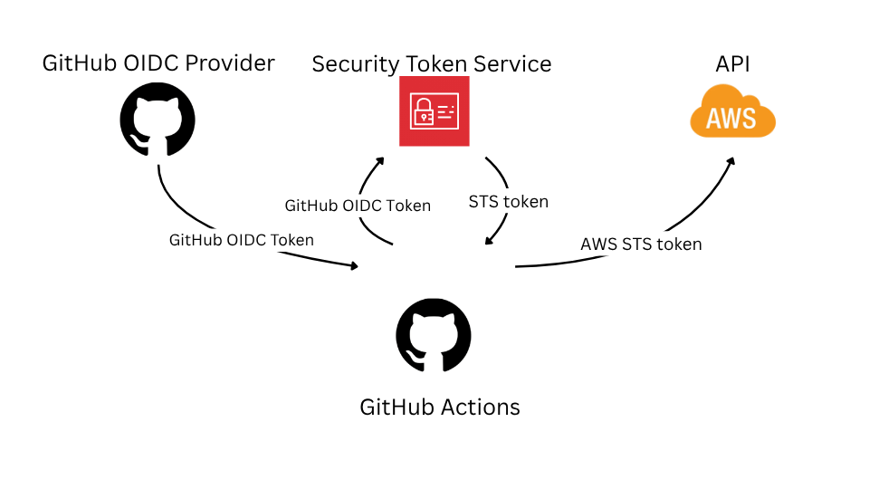

# OIDC: Keycloak JWT Federation



## Introduction

In my previous posts, I mentioned the important topic of zero static credentials. This is especially relevant today, as interactions with AI agents in protected environments can unexpectedly expose credentials.

In this part, I explain how to authenticate GitHub Actions jobs so they can provision Keycloak without static credentials. A dirty trick is involved, and I explain it below.

## GitHub OIDC Provider

GitHub provides a [GitHub Actions OIDC provider](https://docs.github.com/en/actions/concepts/security/openid-connect), so our repository, refs, pull requests, and even environments can act as identities for resource servers that accept OIDC tokens.

The token format and the `sub` claim are covered in my [previous post](/docs/articles/oidc/oidc-aws-federation.md). 

For AWS authentication, I used an official action that helps retrieve a token from the GitHub OIDC provider. Keycloak does not currently have an official action, so I had to use custom steps to obtain the token.

[action.yml](.github/actions/keycloak-token/action.yml)
```yaml
name: Keycloak Token Action
description: 'Action to obtain a Keycloak token'
inputs:
  keycloak-url:
    description: 'The URL of the Keycloak server'
    required: true
  keycloak-realm:
    description: 'The Keycloak realm'
    required: true
  keycloak-base-path:
    description: 'The base path for Keycloak (optional)'
    required: false
runs:
  using: "composite"
  steps:
    - name: Get JWT token
      id: get-gh-token
      env:
        KEYCLOAK_AUDIENCE: "${{ inputs.keycloak-url }}${{ inputs.keycloak-base-path || '' }}/realms/${{ inputs.keycloak-realm }}"
      uses: actions/github-script@v9
      with:
        script: |
          const audience = process.env['KEYCLOAK_AUDIENCE'];
          let ghToken = await core.getIDToken(audience);
          core.setOutput('ghToken', ghToken);

          function decodeJWT(jwtToken) {
            try {
              // A JWT has 3 parts: Header, Payload, Signature
              const [header, payload, signature] = jwtToken.split('.');
              
              // Decode base64url string to standard UTF-8 text
              const decodedPayload = Buffer.from(payload, 'base64').toString('utf8');
              
              // Parse the string into a readable JavaScript object
              return JSON.parse(decodedPayload);
            } catch (error) {
              console.error("Invalid JWT format", error);
              return null;
            }
          }

          console.log('----');
          console.log(decodeJWT(ghToken));
          console.log('----');
```
This composite action uses `actions/github-script` and the `core.getIDToken(audience)` function with a custom audience value. Keycloak [expects](https://openid.net/specs/openid-connect-core-1_0.html#ClientAuthentication) the `aud` claim to match the `issuer_url` of the Keycloak realm endpoint.
> The aud (audience) Claim. Value that identifies the Authorization Server as an intended audience. The Authorization Server MUST verify that it is an intended audience for the token. The Audience SHOULD be the URL of the Authorization Server's Token Endpoint.

Example of a decoded GitHub token from the test workflow:
```json
{
  actor: 'AleksandrSor',
  actor_id: '...',
  aud: 'https://<KEYCLOAK_URL>/auth/realms/demo-infra-project',
  ...
  environment: 'test-keycloak',
  ...
  iss: 'https://token.actions.githubusercontent.com',
  ...
  sub: 'repo:AleksandrSor/demo-infra:environment:test-keycloak',
  ...
}
```

More information about a custom way of obtaining a GitHub OIDC token can be found [here](https://docs.github.com/en/actions/how-tos/secure-your-work/security-harden-deployments/oidc-in-cloud-providers).

Now I need to exchange my GitHub token for a Keycloak token with the correct permissions to manage my Keycloak instance. Before I can do that, I need to register the GitHub OIDC provider in Keycloak.

## Keycloak JWT Federation

I want to eliminate the need to store static credentials, and Keycloak JWT federation helps me achieve that.

The first step to setting up federated client authentication is to define a trust relationship between Keycloak and the external identity providers. This is done by creating a new identity provider in the realm.

Keycloak currently has three types of identity providers that support federated client authentication:

- OpenID Connect

- SPIFFE

- Kubernetes

More information is available in this [blog post](https://www.keycloak.org/2026/01/federated-client-authentication).

Since the GitHub OIDC provider does not expose a client authentication endpoint, it cannot be registered properly as an OpenID Connect provider. It also cannot be used as a SPIFFE provider.

This is where the dirty trick comes in. I register the GitHub OIDC provider as Kubernetes. This works because Keycloak expects an OIDC discovery endpoint at `<ISSUER URL>/.well-known/openid-configuration`, and GitHub exposes it there: [https://token.actions.githubusercontent.com/.well-known/openid-configuration](https://token.actions.githubusercontent.com/.well-known/openid-configuration).

### Register Identity Provider

[github-actions.tf](/IaC/keycloak/github-actions.tf)
```terraform
locals {
  github_actions_issuer = "https://token.actions.githubusercontent.com"
}

resource "keycloak_kubernetes_identity_provider" "github_actions" {
  alias  = "github-actions"
  realm  = keycloak_realm.realm.id
  issuer = local.github_actions_issuer

  lifecycle {
    prevent_destroy = true
  }
}
```

### Create a client for GitHub OIDC

This client uses the [Service Account Roles authentication flow](https://www.keycloak.org/docs/latest/server_admin/index.html#_service_accounts) with
JWT Federated Client Authentication.
[github-actions.tf](/IaC/keycloak/github-actions.tf)
```terraform
resource "keycloak_openid_client" "github_actions" {
  realm_id                     = keycloak_realm.realm.id
  client_id                    = "repo:${local.config.env.repository.name}:environment:${local.config.env.repository.protected_environment}"
  name                         = "github-actions-${replace(local.config.env.repository.name, "/[^a-zA-Z0-9]/", "-")}-env-${local.config.env.repository.protected_environment}"
  enabled                      = true
  access_type                  = "CONFIDENTIAL"
  standard_flow_enabled        = false
  direct_access_grants_enabled = false
  service_accounts_enabled     = true
  client_authenticator_type    = "federated-jwt"

  extra_config = {
    "jwt.credential.issuer" = keycloak_kubernetes_identity_provider.github_actions.alias
    "jwt.credential.sub"    = "repo:${local.config.env.repository.name}:environment:${local.config.env.repository.protected_environment}"
  }

  description = jsonencode(local.config.common_tags)

}
```

Next, assign roles to the service account used by the GitHub Actions workflow.
[github-actions.tf](/IaC/keycloak/github-actions.tf)
```terraform
resource "keycloak_openid_client_service_account_role" "github_actions_service_account_role_realm_admin" {
  realm_id                = keycloak_realm.realm.id
  service_account_user_id = keycloak_openid_client.github_actions.service_account_user_id
  client_id               = data.keycloak_openid_client.realm_management.id
  role                    = data.keycloak_role.realm-admin.name
}

resource "keycloak_openid_client_service_account_role" "github_actions_service_account_role_query_realms" {
  realm_id                = keycloak_realm.realm.id
  service_account_user_id = keycloak_openid_client.github_actions.service_account_user_id
  client_id               = data.keycloak_openid_client.realm_management.id
  role                    = data.keycloak_role.query-realms.name
}
```
[realm-management.tf](/IaC/keycloak/realm-management.tf)
```terraform
data "keycloak_openid_client" "realm_management" {
  realm_id  = keycloak_realm.realm.id
  client_id = "realm-management"
}

data "keycloak_role" "realm-admin" {
  realm_id  = keycloak_realm.realm.id
  client_id = data.keycloak_openid_client.realm_management.id
  name      = "realm-admin"
}

data "keycloak_role" "query-realms" {
  realm_id  = keycloak_realm.realm.id
  client_id = data.keycloak_openid_client.realm_management.id
  name      = "query-realms"
}
```

### Token Exchange

Now I can exchange my GitHub token for Keycloak token.

[action.yml](/.github/actions/keycloak-token/action.yml)
```yaml
    - name: Get KC token
      id: get-kc-token
      shell: bash
      run: |
        KEYCLOAK_RESPONSE=$(curl -s "${{ inputs.keycloak-url }}${{ inputs.keycloak-base-path || '' }}/realms/${{ inputs.keycloak-realm }}/protocol/openid-connect/token" \
          -H 'Content-Type: application/x-www-form-urlencoded' \
          -d 'grant_type=client_credentials' \
          -d 'scope=openid' \
          -d 'client_id=${{ inputs.keycloak-client-id }}' \
          -d 'client_assertion_type=urn:ietf:params:oauth:client-assertion-type:jwt-bearer' \
          -d 'client_assertion=${{ steps.get-gh-token.outputs.ghToken }}' | jq -r '.')
        KEYCLOAK_TOKEN=$(echo $KEYCLOAK_RESPONSE | jq -r '.access_token')
        echo "keycloakAccessToken=${KEYCLOAK_TOKEN}" >> $GITHUB_OUTPUT
        echo "keycloakIdToken=${KEYCLOAK_TOKEN}" >> $GITHUB_OUTPUT
        echo "----"
        echo "KC Response:"
        echo "${KEYCLOAK_RESPONSE}"
        echo "----"
        echo "Decoded KC Token:"
        echo "${KEYCLOAK_TOKEN}" | jq -R 'split(".") | .[0],.[1] | @base64d | fromjson'
        echo "----"
```
The most important parts of the request are:
- `grant_type=client_credentials`: specifies the authentication flow type.
- `client_assertion_type=urn:ietf:params:oauth:client-assertion-type:jwt-bearer`: specifies the assertion type used for client authentication.
- `client_assertion=${{ steps.get-gh-token.outputs.ghToken }}`: passes the GitHub token as the client assertion.

Documentation is available [here](https://openid.net/specs/openid-connect-core-1_0.html#ClientAuthentication).


Example of a decoded Keycloak token from the test workflow:
```json
{
    ...
    "iss": "https://<KEYCLOAK_URL>/auth/realms/demo-infra-project",
    "aud": [
      "realm-management",
      "account"
    ],
    "sub": "2a428d3a-4359-49f4-abcd-607fdb23aa8f",
    ...
    "azp": "repo:AleksandrSor/demo-infra:environment:test-keycloak",
    "resource_access": {
      "realm-management": {
        "roles": [
          "view-realm",
          "query-realms"
        ]
      },
      "account": {
        "roles": [
          "manage-account",
          "manage-account-links",
          "view-profile"
        ]
      }
    },
    ...
    "client_id": "repo:AleksandrSor/demo-infra:environment:test-keycloak"
  }
```

### Testing the Keycloak token

To run a quick test, we can execute the following jobs against our Keycloak instance:
```yaml
ame: test JWT
on:
  push:
    branches:
      - test/test-jwt

permissions:
  contents: read  
  id-token: write # Required to request OIDC token for Terraform Cloud API authentication

jobs:
  test-jwt:
    runs-on: ubuntu-24.04-arm
    environment: 
      name: test-keycloak
      deployment: false
    env:
      DEPLOY_ENV: test-keycloak
      KEYCLOAK_URL: ${{ vars.KEYCLOAK_URL }}
      KEYCLOAK_REALM: ${{ vars.KEYCLOAK_REALM }}
      KEYCLOAK_AUDIENCE: "${{ vars.KEYCLOAK_URL }}${{ vars.KEYCLOAK_BASE_PATH || '' }}/realms/${{ vars.KEYCLOAK_REALM }}"
      KEYCLOAK_BASE_PATH: ${{ vars.KEYCLOAK_BASE_PATH || '' }} # legacy path /auth
    steps:
      - id: keycloak-token
        name: Get KC token
        uses: ./.github/actions/keycloak-token
        with:
          keycloak-url: ${{ env.KEYCLOAK_URL }}
          keycloak-realm: ${{ env.KEYCLOAK_REALM }}
          keycloak-client-id: repo:${{ github.repository }}:environment:${{ env.DEPLOY_ENV }}
          keycloak-base-path: ${{ env.KEYCLOAK_BASE_PATH || ''}}
      - name: Test KC token
        run: |
          KEYCLOAK_RESPONSE=$(curl -s "${KEYCLOAK_URL}${KEYCLOAK_BASE_PATH}/realms/$KEYCLOAK_REALM/protocol/openid-connect/userinfo" \
            -H "Authorization: Bearer ${{ steps.keycloak-token.outputs.id-token }}" | jq -r '.')
          echo "----"
          echo "${KEYCLOAK_RESPONSE}"
          echo "----"
      - name: Admin Test KC token
        run: |
          KEYCLOAK_RESPONSE=$(curl -s "${KEYCLOAK_URL}${KEYCLOAK_BASE_PATH}/admin/realms/$KEYCLOAK_REALM" \
            -H "Authorization: Bearer ${{ steps.keycloak-token.outputs.access-token }}" \
            -H "Accept: application/json" | jq -r '.')
          echo "----"
          echo "${KEYCLOAK_RESPONSE}"
          echo "----"
```

Output:
```json
Run KEYCLOAK_RESPONSE=$(curl -s "${KEYCLOAK_URL}${KEYCLOAK_BASE_PATH}/realms/$KEYCLOAK_REALM/protocol/openid-connect/userinfo" \
----
{
  "sub": "2a428d3a-4359-49f4-abcd-607fdb23aa8f",
  "email_verified": false,
  "preferred_username": "service-account-repo:aleksandrsor/demo-infra:environment:test-keycloak"
}
```

## Additional links

- [OpenID Connect Core 1.0](https://openid.net/specs/openid-connect-core-1_0.html)
- [Keycloak: Federated client authentication](https://www.keycloak.org/2026/01/federated-client-authentication)
- [Terraform Registry: Keycloak provider](https://registry.terraform.io/providers/keycloak/keycloak/latest)
- [GitHub Actions: OIDC in cloud providers](https://docs.github.com/en/actions/how-tos/secure-your-work/security-harden-deployments/oidc-in-cloud-providers)
