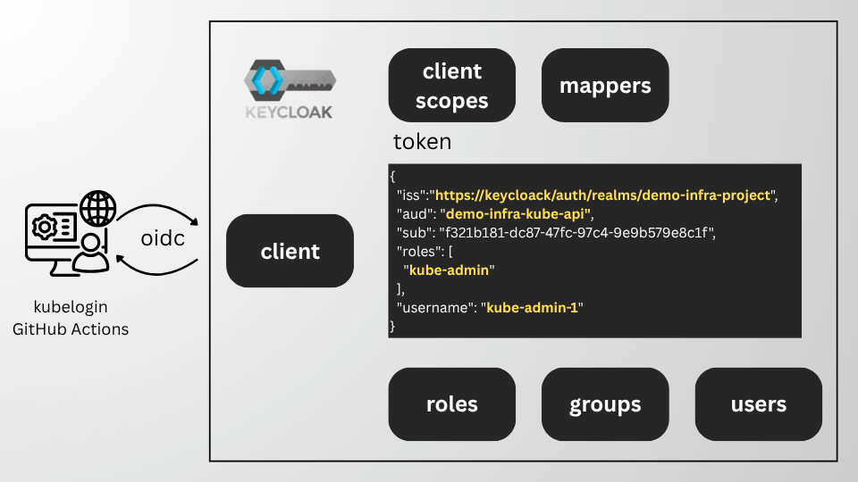

# OIDC: Keycloak setup for ALB Gateway API



## Introduction

In my [previous article](./oidc-jwt-validation.md), I tested using ALB CRDs to offload JWT validation for OIDC-based authentication to the Amazon EKS Kubernetes API.

In this article, I will share the Terraform/OpenTofu stack required to set up Keycloak as the OIDC provider and explain how it works.

I am using the official [Keycloak Terraform provider](https://registry.terraform.io/providers/keycloak/keycloak/latest/docs).
The provider documentation clearly explains how to connect Terraform/OpenTofu to a Keycloak instance.

For the testing setup, I used a service-account client configuration (Client Credentials grant in OAuth 2.0) and environment variables to configure the provider.
```bash
KEYCLOAK_URL='https://your_keycloak/auth/realms/demo-infra-project'
KEYCLOAK_REALM='demo-infra-project'
KEYCLOAK_BASE_PATH='/auth'
KEYCLOAK_CLIENT_ID='terraform'
KEYCLOAK_CLIENT_SECRET='secret'
```
This declaration is enough to make it work:
```hcl
provider "keycloak" {

}
```
For GitHub Actions runners, I used a JWT-federated client. It deserves a dedicated article on how to set it up.

## Client

A [Keycloak client](https://www.keycloak.org/docs/latest/server_admin/index.html#assembly-managing-clients_server_administration_guide) is the entry point your OIDC client uses to obtain authentication tokens.

[kube-api-client.tf](https://github.com/AleksandrSor/demo-infra/blob/main/IaC/keycloak/kube-api-client.tf)
```hcl
  realm_id  = keycloak_realm.realm.id
  client_id = "${local.config.project.name}-kube-api"
  name      = "${local.config.project.name}-kube-api"

  enabled = true

  access_type = "CONFIDENTIAL"

  client_authenticator_type = "client-secret"

  standard_flow_enabled                     = true
  implicit_flow_enabled                     = false
  direct_access_grants_enabled              = false
  service_accounts_enabled                  = false
  standard_token_exchange_enabled           = false
  oauth2_jwt_authorization_grant_enabled    = false
  oauth2_device_authorization_grant_enabled = false

  full_scope_allowed = false

  valid_redirect_uris = [
    "http://localhost:8000",
    "http://localhost:18000",
    "https://oauth.pstmn.io/v1/callback",
    "https://oauth.pstmn.io/v1/browser-callback",
  ]

  web_origins = [
    "+",
  ]
```

### Explanation

```hcl
access_type = "CONFIDENTIAL"
client_authenticator_type = "client-secret"
```
Creates a non-public client with a client secret.

```hcl
standard_flow_enabled                     = true
```
Enables the [Authorization Code Grant flow](https://aaronparecki.com/oauth-2-simplified/).

```hcl
full_scope_allowed = false
```
The token contains only the roles scoped for this client.

```hcl
valid_redirect_uris = [
    "http://localhost:8000",
    "http://localhost:18000",
    "https://oauth.pstmn.io/v1/callback",
    "https://oauth.pstmn.io/v1/browser-callback",
]
```
These are the redirect URLs allowed for the standard flow.

```text
    "http://localhost:8000",
    "http://localhost:18000",
```
For [kubelogin](https://github.com/int128/kubelogin).

```text
    "https://oauth.pstmn.io/v1/callback",
    "https://oauth.pstmn.io/v1/browser-callback",
```
For [Postman](https://learning.postman.com/docs/use/send-requests/authorization/oauth-20).


## Client roles

[Client roles](https://www.keycloak.org/docs/latest/server_admin/#con-client-roles_server_administration_guide) are dedicated to this client.

[kube-api-client-roles.tf](https://github.com/AleksandrSor/demo-infra/blob/main/IaC/keycloak/kube-api-client-roles.tf)
```hcl
resource "keycloak_role" "kube_api_cluster_admin" {
  realm_id    = keycloak_realm.realm.id
  client_id   = keycloak_openid_client.kube_api.id
  name        = "admin"
  description = "cluster-admin role for kube-api"
}
```
This client-specific role will be included in the token's role claim if it is assigned to a user.

## Groups

[Groups in Keycloak](https://www.keycloak.org/docs/latest/server_admin/index.html#proc-managing-groups_server_administration_guide) manage role mappings for each user.

kube-groups.tf
```hcl
resource "keycloak_group" "kube_admin" {
  realm_id = keycloak_realm.realm.id
  name     = "kube-admin"
}

resource "keycloak_group_roles" "kube_admin_group_roles" {
  realm_id = keycloak_realm.realm.id
  group_id = keycloak_group.kube_admin.id

  role_ids = [
    keycloak_role.kube_api_cluster_admin.id,
  ]
}
```
I'm mapping a client-specific role to a group.

## Users

[Managing users](https://www.keycloak.org/docs/latest/server_admin/index.html#assembly-managing-users_server_administration_guide).

[kube-users.tf](https://github.com/AleksandrSor/demo-infra/blob/main/IaC/keycloak/kube-users.tf)
```hcl
resource "keycloak_user" "kube_user" {
  realm_id       = keycloak_realm.realm.id
  for_each       = { for user in local.config.keycloak.users : user.username => user }
  username       = each.value.username
  email          = each.value.email
  email_verified = true

  lifecycle {
    ignore_changes = [
      first_name,
      last_name,
    ]
  }
}
```


[kube-user-groups.tf](https://github.com/AleksandrSor/demo-infra/blob/main/IaC/keycloak/kube-user-groups.tf) assigns them to groups.
```hcl
resource "keycloak_user_groups" "kube_admin_user_groups" {
  for_each = {
    for user in local.config.keycloak.users : user.username => user
    if contains(try(user.groups, []), keycloak_group.kube_admin.name)
  }
  realm_id   = keycloak_realm.realm.id
  user_id    = keycloak_user.kube_user[each.key].id
  exhaustive = false

  group_ids = [
    keycloak_group.kube_admin.id
  ]
}
```

## Client scope

[Shared client configuration](https://www.keycloak.org/docs/latest/server_admin/#_client_scopes) is an entity called a client scope. In my example, it is simply a set of protocol mappers.

[kube-api-client-scope.tf](https://github.com/AleksandrSor/demo-infra/blob/main/IaC/keycloak/kube-api-client-scope.tf)
```hcl
resource "keycloak_openid_client_scope" "kube_api" {
  realm_id = keycloak_realm.realm.id
  name     = "kube-api"
}
```

## Client scope mappers

OIDC token [mappers](https://www.keycloak.org/docs/latest/server_admin/#_protocol-mappers) for the kube-api client scope.


[kube-api-client-scope-mapper.tf](https://github.com/AleksandrSor/demo-infra/blob/main/IaC/keycloak/kube-api-client-scope-mapper.tf)

### Username mapper
```hcl
resource "keycloak_openid_user_attribute_protocol_mapper" "kube_api_username" {
  realm_id        = keycloak_realm.realm.id
  client_scope_id = keycloak_openid_client_scope.kube_api.id
  name            = "username"

  user_attribute = "username"
  claim_name     = "username"

  add_to_access_token = true
  add_to_id_token     = true
}

```
***add_to_access_token*** — adds this mapping to an access token

***add_to_id_token*** — adds this mapping to an OIDC ID token

### Role mapper — the most important one
```hcl
resource "keycloak_openid_user_client_role_protocol_mapper" "kube_api_user_client_role_mapper" {
  realm_id        = keycloak_realm.realm.id
  client_scope_id = keycloak_openid_client_scope.kube_api.id
  name            = "kube-api-roles"

  claim_name       = "roles"
  claim_value_type = "String"
  multivalued      = true

  client_id_for_role_mappings = keycloak_openid_client.kube_api.client_id
  client_role_prefix          = "kube-"

  add_to_access_token = true
  add_to_id_token     = true
}
```
***claim_name*** — claim name

***client_id_for_role_mappings*** — client used for role mapping

***client_role_prefix*** — prefix for the role value

As a result, the roles claim contains a flat, single-level list of assigned roles.

### Audience mapper

Mapping the clientID to the audience claim enables [additional token validation](https://github.com/AleksandrSor/demo-infra/blob/6503ff504cf5a4e77697048d20a2c44f8132d2f4/fluxcd/infra/envoy-kube-proxy/prod/ListenerRuleConfiguration.yaml#L11).

```hcl
resource "keycloak_openid_audience_protocol_mapper" "audience_mapper" {
  realm_id        = keycloak_realm.realm.id
  client_scope_id = keycloak_openid_client_scope.kube_api.id
  name            = "audience-mapper-client-id"

  included_client_audience = keycloak_openid_client.kube_api.client_id
  add_to_access_token      = true
  add_to_id_token          = true
}
```

## Role scope mapping

[Role scope mapping](https://www.keycloak.org/docs/latest/server_admin/#_client_scope_mappings) limits the roles declared inside the client access token.

[kube-api-client-scope-roles.tf](https://github.com/AleksandrSor/demo-infra/blob/main/IaC/keycloak/kube-api-client-scope-roles.tf)

```hcl
resource "keycloak_generic_role_mapper" "kube_api_cluster_admin" {
  realm_id        = keycloak_realm.realm.id
  client_scope_id = keycloak_openid_client_scope.kube_api.id
  role_id         = keycloak_role.kube_api_cluster_admin.id
}
```

## Default and optional client scopes

[Linking](https://www.keycloak.org/docs/latest/server_admin/#_client_scopes_linking) between a client scope and a client.

[kube-api-client-scope.tf](https://github.com/AleksandrSor/demo-infra/blob/main/IaC/keycloak/kube-api-client-scope.tf).
```hcl
resource "keycloak_openid_client_default_scopes" "kube_api" {
  realm_id  = keycloak_realm.realm.id
  client_id = keycloak_openid_client.kube_api.id

  default_scopes = [
    data.keycloak_openid_client_scope.acr.name,
    data.keycloak_openid_client_scope.basic.name,
    data.keycloak_openid_client_scope.web_origins.name,
    keycloak_openid_client_scope.kube_api.name,
  ]
}

resource "keycloak_openid_client_optional_scopes" "kube_api" {
  realm_id  = keycloak_realm.realm.id
  client_id = keycloak_openid_client.kube_api.id

  optional_scopes = [

  ]
}
```
`acr`, `basic`, and `web_origins` are default pre-existing mappers.
This configuration keeps the token simple, clean, and not overly verbose.

## Result

Now I can get a token with [Postman](https://learning.postman.com/docs/use/send-requests/authorization/oauth-20) to explore it.

```json
{
  "exp": ...,
  "iat": ...,
  "auth_time": ...,
  "jti": "onrtac:4bb64894-da54-df2b-8879-7c4429366d81",
  "iss": "https://keycloaj/auth/realms/demo-infra-project",
  "aud": "demo-infra-kube-api",
  "sub": "f321b181-dc87-47fc-97c4-9e9b579e8c1f",
  "typ": "Bearer",
  "azp": "demo-infra-kube-api",
  "sid": "5y5bl3zlY6tbLXHAWcT8s1Zf",
  "acr": "1",
  "allowed-origins": [
    "https://oauth.pstmn.io",
    "http://localhost:18000",
    "http://localhost:8000"
  ],
  "scope": "openid kube-api",
  "roles": [
    "kube-admin"
  ],
  "username": "kube-admin-1"
}
```
The important claims are:
- `iss` — issuer
- `aud` — target audience
- `roles` — mapping for Kubernetes groups in RBAC
- `username` — username for Kubernetes

## What next

Now I can pass parameters from a provisioned client into a Kubernetes secret via the External Secrets Operator (ESO) and Flux CD variable substitution, and use them as parameters in ALB CRDs. I will cover this in my next article. Follow me!