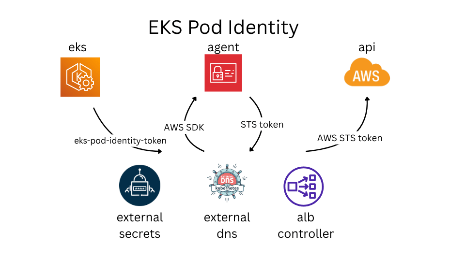

# OIDC: EKS Pod Identity



## Introduction

In my last post, I briefly mentioned the important topic of zero static credentials. This is especially relevant today, as interactions with AI agents in protected environments can unexpectedly expose credentials.

My entire demo flow requires zero static credentials. Let me explain it in more detail in three parts. Follow along for future posts.

## Kubernetes as an OIDC-compliant identity provider

You may be surprised to learn that a [ServiceAccount token](https://kubernetes.io/docs/tasks/configure-pod-container/configure-service-account/) issued by the Kubernetes control plane is an OIDC-compliant JWT. This makes Kubernetes an OIDC-compliant identity provider for external services.

The Kubernetes API server even publishes an OpenID Provider Configuration document at `/.well-known/openid-configuration` and a related JSON Web Key Set (JWKS) at `/openid/v1/jwks`.

However, there are a few limitations.
First, the issuer URL is set out of the box to either https://kubernetes.default.svc.cluster.local or https://kubernetes.default.svc, depending on the distribution.
Second, the OpenID Provider Configuration endpoint (/.well-known/openid-configuration) and the JWKS endpoint are not publicly accessible by default.
You can address this by configuring the API server with the --service-account-issuer and --service-account-jwks-uri flags and by mirroring the OIDC endpoints to a public server.

You may be surprised to learn (yes, again) that AWS EKS addresses this out of the box. Thanks to [IRSA](https://docs.aws.amazon.com/eks/latest/userguide/iam-roles-for-service-accounts.html), it uses OIDC to integrate with AWS IAM.

Run the following command:
```
aws eks describe-cluster \
  --name <your-cluster-name> \
  --query "cluster.identity.oidc.issuer" \
  --output text
```
Then append the OIDC discovery path `/.well-known/openid-configuration` to the returned issuer URL.

## EKS Pod Identity Agent

[EKS Pod Identity](https://docs.aws.amazon.com/eks/latest/userguide/pod-identities.html) is a new way to grant an IAM role to an application running in a pod. AWS recommends using EKS Pod Identity whenever possible to grant pods access to AWS resources. [A comparison table is also available here](https://docs.aws.amazon.com/eks/latest/userguide/service-accounts.html).

### How it works

#### 1. [Create a Pod Identity association](https://docs.aws.amazon.com/eks/latest/userguide/pod-id-assign-target-role.html#_how_it_works)

Create it outside Kubernetes, for example:
[eso-addon.tf](/IaC/aws-eks/eso-addon.tf)
```hcl
resource "aws_eks_pod_identity_association" "eso_addon" {
  cluster_name    = aws_eks_cluster.cluster.name  #eks cluster name
  namespace       = local.eso_namespace
  service_account = local.eso_service_account
  role_arn        = aws_iam_role.eso_role.arn     #role for service account
}
``` 
This association can be created before the namespace and service account are created.

#### 2. [When Amazon EKS starts a new pod](https://docs.aws.amazon.com/eks/latest/userguide/pod-id-how-it-works.html#pod-id-agent-pod)

When a new pod uses a service account with an EKS Pod Identity association, Amazon EKS adds the following content to the pod manifest:
```yaml
    env:
    - name: AWS_CONTAINER_AUTHORIZATION_TOKEN_FILE
      value: "/var/run/secrets/pods.eks.amazonaws.com/serviceaccount/eks-pod-identity-token"
    - name: AWS_CONTAINER_CREDENTIALS_FULL_URI
      value: "http://169.254.170.23/v1/credentials"
    volumeMounts:
    - mountPath: "/var/run/secrets/pods.eks.amazonaws.com/serviceaccount/"
      name: eks-pod-identity-token
  volumes:
  - name: eks-pod-identity-token
    projected:
      defaultMode: 420
      sources:
      - serviceAccountToken:
          audience: pods.eks.amazonaws.com
          expirationSeconds: 86400 # 24 hours
          path: eks-pod-identity-token
```
Pay attention to the volume configuration: it uses a [projected volume](https://kubernetes.io/docs/concepts/storage/projected-volumes/) with a [TokenRequest](https://kubernetes.io/docs/reference/kubernetes-api/storage/csi-driver-v1/#TokenRequest).
Kubernetes places a service account token with a specific audience at `/var/run/secrets/pods.eks.amazonaws.com/serviceaccount/eks-pod-identity-token`.
You can inspect it with:
```bash
cat /var/run/secrets/pods.eks.amazonaws.com/serviceaccount/eks-pod-identity-token \
  | cut -d. -f2 \
  | base64 -d 2>/dev/null \
  | jq .
```
It looks like this:
```JSON
{
  "aud": [
    "pods.eks.amazonaws.com"
  ],
  "iss": "https://oidc.eks.us-east-1.amazonaws.com/id/<EKS_CLUSTER_ID>",
  "kubernetes.io": {
    "namespace": "external-secrets",
    "node": {
      "name": "<EKS_NODE_NAME>"
    },
    "pod": {
      "name": "external-secrets-debug"
    },
    "serviceaccount": {
      "name": "external-secrets"
    }
  },
  "sub": "system:serviceaccount:external-secrets:external-secrets"
}
```

#### 3. An application running in a pod obtains AWS STS credentials

through the AWS SDK by using `eks-pod-identity-token` with `AWS_CONTAINER_CREDENTIALS_FULL_URI`:
```yaml
    env:
    - name: AWS_CONTAINER_AUTHORIZATION_TOKEN_FILE
      value: "/var/run/secrets/pods.eks.amazonaws.com/serviceaccount/eks-pod-identity-token"
    - name: AWS_CONTAINER_CREDENTIALS_FULL_URI
      value: "http://169.254.170.23/v1/credentials"
```
Note that this is a local bind address. The Pod Identity Agent must run on the node.

### Installation

Prerequisites and documentation are available [here](https://docs.aws.amazon.com/eks/latest/userguide/pod-id-agent-setup.html#pod-id-agent-add-on-create).
Examples from this demo project are shown below.
Since my node role already includes `AmazonEKSWorkerNodePolicy`:

[eks-nodes-iam-roles](/IaC/aws-eks/eks-nodes-iam-roles.tf)
```terraform
resource "aws_iam_role_policy_attachment" "eks_worker_node_policy" {
  policy_arn = "arn:aws:iam::aws:policy/AmazonEKSWorkerNodePolicy"
  role       = aws_iam_role.nodes.name
}
```
I only need to install the add-on:

[eks-addon-pod-identity-agent](/IaC/aws-eks/eks-addon-pod-identity-agent.tf)
```terraform
data "aws_eks_addon_version" "latest_pod_identity_agent" {
  addon_name         = "eks-pod-identity-agent"
  kubernetes_version = aws_eks_cluster.cluster.version
  most_recent        = true
}


resource "aws_eks_addon" "pod_identity_agent" {
  cluster_name  = aws_eks_cluster.cluster.name
  addon_name    = "eks-pod-identity-agent"
  addon_version = data.aws_eks_addon_version.latest_pod_identity_agent.version

  resolve_conflicts_on_update = "OVERWRITE"
}
```

### External Secrets configuration for Pod Identity

Documentation is available [here](https://external-secrets.io/latest/provider/aws-access/).

[eso-addon.tf](/IaC/aws-eks/eso-addon.tf)

Assume role policy and IAM role:
```terraform
locals {
  eso_namespace       = "external-secrets"
  eso_service_account = "external-secrets"
}

data "aws_iam_policy_document" "eso_assume_role" {
  statement {
    effect = "Allow"

    principals {
      type        = "Service"
      identifiers = ["pods.eks.amazonaws.com"]
    }

    actions = [
      "sts:AssumeRole",
      "sts:TagSession"
    ]

    condition {
      test     = "StringEquals"
      variable = "aws:RequestTag/kubernetes-namespace"
      values   = [local.eso_namespace]
    }

    condition {
      test     = "StringEquals"
      variable = "aws:RequestTag/kubernetes-service-account"
      values   = [local.eso_service_account]
    }
  }
}

resource "aws_iam_role" "eso_role" {
  name               = "${local.config.project.name}-external-secrets-addon"
  assume_role_policy = data.aws_iam_policy_document.eso_assume_role.json
}
```


IAM role policy:
```terraform
# Reference: https://external-secrets.io/latest/provider/aws-secrets-manager/
data "aws_iam_policy_document" "eso_addon" {
  statement {
    effect = "Allow"

    actions = [
      "secretsmanager:ListSecrets",
      "secretsmanager:BatchGetSecretValue"
    ]

    resources = ["*"]
  }

  statement {
    effect = "Allow"

    actions = [
      "secretsmanager:GetResourcePolicy",
      "secretsmanager:GetSecretValue",
      "secretsmanager:DescribeSecret",
      "secretsmanager:ListSecretVersionIds"
    ]

    resources = [
      "arn:aws:secretsmanager:${data.aws_region.current.region}:${data.aws_caller_identity.current.account_id}:secret:${local.config.project.name}-*"
    ]
  }
}

resource "aws_iam_policy" "eso_addon" {
  name   = "${local.config.project.name}-external-secrets-addon"
  policy = data.aws_iam_policy_document.eso_addon.json
}

resource "aws_iam_role_policy_attachment" "eso_addon_policy_attachment" {
  role       = aws_iam_role.eso_role.name
  policy_arn = aws_iam_policy.eso_addon.arn
}
```


Pod Identity association:
```terraform
resource "aws_eks_pod_identity_association" "eso_addon" {
  cluster_name    = aws_eks_cluster.cluster.name
  namespace       = local.eso_namespace
  service_account = local.eso_service_account
  role_arn        = aws_iam_role.eso_role.arn
}
```

### External DNS configuration for Pod Identity

[externaldns-iam-role-and-identity.tf](/IaC/aws-route53-and-certs/externaldns-iam-role-and-identity.tf)

Assume role policy and IAM role:
```terraform
data "aws_iam_policy_document" "externaldns_assume_role" {
  statement {
    effect = "Allow"

    principals {
      type        = "Service"
      identifiers = ["pods.eks.amazonaws.com"]
    }

    actions = [
      "sts:AssumeRole",
      "sts:TagSession"
    ]

    condition {
      test     = "StringEquals"
      variable = "aws:RequestTag/kubernetes-namespace"
      values   = [local.externaldns_namespace]
    }

    condition {
      test     = "StringEquals"
      variable = "aws:RequestTag/kubernetes-service-account"
      values   = [local.externaldns_service_account]
    }
  }
}

resource "aws_iam_role" "externaldns_role" {
  name               = "${local.config.project.name}-externaldns-addon"
  assume_role_policy = data.aws_iam_policy_document.externaldns_assume_role.json
}
```


IAM role policy:
```terraform
data "aws_iam_policy_document" "externaldns_policy" {
  statement {
    effect = "Allow"

    actions = [
      "route53:ChangeResourceRecordSets",
      "route53:ListResourceRecordSets",
      "route53:ListTagsForResources"
    ]

    resources = [
      for zone in aws_route53_zone.managed : zone.arn
    ]
  }

  statement {
    effect = "Allow"

    actions = [
      "route53:ListHostedZones",
      "route53:ListHostedZonesByName"
    ]

    resources = ["*"]
  }
}

resource "aws_iam_policy" "externaldns_policy" {
  name   = "${local.config.project.name}-externaldns-policy"
  policy = data.aws_iam_policy_document.externaldns_policy.json
}

resource "aws_iam_role_policy_attachment" "externaldns_policy_attachment" {
  role       = aws_iam_role.externaldns_role.name
  policy_arn = aws_iam_policy.externaldns_policy.arn
}
```


Pod Identity association:
```terraform
resource "aws_eks_pod_identity_association" "externaldns" {
  cluster_name    = var.eks_cluster_name
  namespace       = local.externaldns_namespace
  service_account = local.externaldns_service_account
  role_arn        = aws_iam_role.externaldns_role.arn
}
```

### AWS Load Balancer Controller configuration for Pod Identity

Documentation is available [here](https://github.com/kubernetes-sigs/aws-load-balancer-controller/tree/main/helm/aws-load-balancer-controller#setup-iam-for-serviceaccount).

[alb-role.tf](/IaC/aws-eks/alb-role.tf)

Assume role policy and IAM role:
```terraform
locals {
  alb_namespace       = "kube-system"
  alb_service_account = "aws-load-balancer-controller"
}

data "aws_iam_policy_document" "alb_assume_role" {
  statement {
    effect = "Allow"

    principals {
      type        = "Service"
      identifiers = ["pods.eks.amazonaws.com"]
    }

    actions = [
      "sts:AssumeRole",
      "sts:TagSession"
    ]

    condition {
      test     = "StringEquals"
      variable = "aws:RequestTag/kubernetes-namespace"
      values   = [local.alb_namespace]
    }

    condition {
      test     = "StringEquals"
      variable = "aws:RequestTag/kubernetes-service-account"
      values   = [local.alb_service_account]
    }
  }
}

resource "aws_iam_role" "alb_controller_role" {
  name               = "${local.config.project.name}-alb-controller-role"
  assume_role_policy = data.aws_iam_policy_document.alb_assume_role.json
}
```


IAM role policy:
```terraform
locals {
  alb_policy_url      = "https://raw.githubusercontent.com/kubernetes-sigs/aws-load-balancer-controller/main/docs/install/iam_policy.json"
}

data "http" "alb_iam_policy_source" {
  url = local.alb_policy_url

  request_headers = {
    Accept = "application/json"
  }
}


resource "aws_iam_policy" "alb_load_balancer_controller" {
  name        = "${local.config.project.name}-alb-controller-policy"
  description = "IAM policy for AWS ALB Load Balancer Controller"
  policy      = data.http.alb_iam_policy_source.response_body
}

resource "aws_iam_role_policy_attachment" "alb_controller_role_attachment" {
  policy_arn = aws_iam_policy.alb_load_balancer_controller.arn
  role       = aws_iam_role.alb_controller_role.name
}
```


Pod Identity association:
```terraform
resource "aws_eks_pod_identity_association" "alb_controller" {
  cluster_name    = aws_eks_cluster.cluster.name
  role_arn        = aws_iam_role.alb_controller_role.arn
  namespace       = local.alb_namespace
  service_account = local.alb_service_account
}
```

